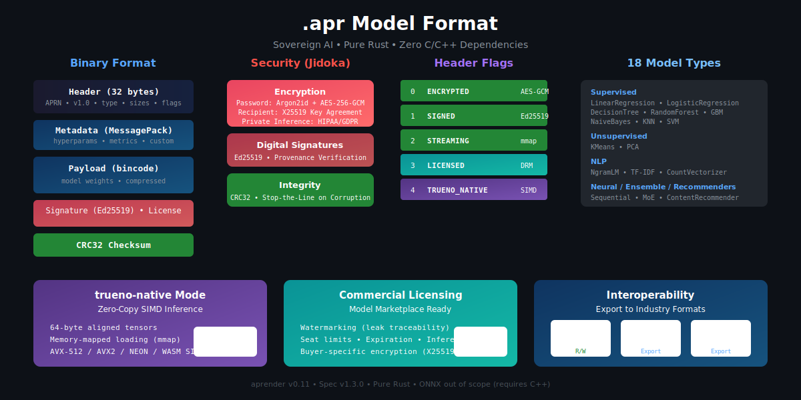

<h1 align="center">aprender</h1>
<h4 align="center">Next Generation Machine Learning, Statistics and Deep Learning in PURE Rust</h4>

<p align="center">
  <a href="https://github.com/paiml/aprender/actions/workflows/ci.yml">
    
  </a>
  <a href="https://codecov.io/gh/paiml/aprender">
    
  </a>
  <a href="https://opensource.org/licenses/MIT">
    
  </a>
  <a href="https://github.com/noahgift/pmat">
    
  </a>
  <a href="https://crates.io/crates/aprender">
    
  </a>
  <a href="https://docs.rs/aprender">
    
  </a>
</p>

<p align="center">
  
</p>

## Overview

Aprender is a lightweight, pure Rust machine learning library designed for efficiency and ease of use. Built with EXTREME TDD methodology, it provides reliable implementations of core ML algorithms with comprehensive test coverage.

## Sovereign AI Stack

aprender is part of the **[Paiml Sovereign AI Stack](docs/sovereign-ai-stack.md)** - a complete pure Rust ML/AI ecosystem.

```
┌─────────────────────────────────────────────────────────────┐
│                   SOVEREIGN AI STACK                        │
├─────────────────────────────────────────────────────────────┤
│  APPLICATION   ruchy · depyler · decy · batuta              │
├─────────────────────────────────────────────────────────────┤
│  ML/AI         realizar · entrenar · ★ aprender ★           │
├─────────────────────────────────────────────────────────────┤
│  DATA          alimentar · trueno-db · trueno-graph         │
├─────────────────────────────────────────────────────────────┤
│  COMPUTE       trueno (SIMD/GPU/WASM) · repartir            │
├─────────────────────────────────────────────────────────────┤
│  QUALITY       pmat · certeza · renacer · verificar         │
└─────────────────────────────────────────────────────────────┘
```

**Key Properties:**
- **Pure Rust** - No Python, no FFI, WASM-compatible
- **Sovereign** - Runs on-premises, EU clouds, or air-gapped
- **GPU/SIMD** - Hardware acceleration via trueno
- **Zero US dependency** - S3-compatible (MinIO, Scaleway, OVH)

→ [Full stack documentation](docs/sovereign-ai-stack.md)

## Features

### Core Primitives
- **Vector** - 1D numerical array with statistical operations (mean, sum, dot, norm, variance)
  - Powered by [trueno](https://github.com/paiml/trueno) v0.4.1 for SIMD acceleration
- **Matrix** - 2D numerical array with linear algebra (matmul, transpose, Cholesky decomposition)
  - SIMD-optimized operations via trueno backend
- **DataFrame** - Named column container for ML data preparation workflows

### Supervised Learning (TOP 10 ML Algorithms ✅)
- **LinearRegression** - Ordinary Least Squares via normal equations
- **LogisticRegression** - Binary/multi-class classification with gradient descent
- **DecisionTreeClassifier** - GINI-based decision tree with configurable max depth
- **RandomForestClassifier** - Bootstrap aggregating ensemble with majority voting
- **GradientBoostingClassifier** - Adaptive boosting with residual learning
- **NaiveBayes** (GaussianNB) - Probabilistic classification with Bayes' theorem
- **KNeighborsClassifier** - Distance-based classification (k-NN)
- **LinearSVM** - Support Vector Machine with hinge loss and subgradient descent

### Unsupervised Learning
- **KMeans** - K-means++ initialization with Lloyd's algorithm
- **DBSCAN** - Density-based clustering with eps and min_samples
- **HierarchicalClustering** - Agglomerative clustering with linkage methods
- **GaussianMixture** - EM algorithm for soft clustering
- **SpectralClustering** - Graph Laplacian eigendecomposition clustering
- **IsolationForest** - Ensemble-based anomaly detection
- **LocalOutlierFactor** - Density-based outlier detection
- **PCA** - Principal Component Analysis for dimensionality reduction (TOP 10 ✅)
- **TSNE** - t-SNE for non-linear visualization

### Graph Algorithms
- **Graph** - Adjacency list representation with weighted/unweighted edges
- **Betweenness Centrality** - Shortest path-based node importance
- **PageRank** - Iterative power method for node ranking
- **Louvain** - Community detection via modularity optimization

### Association Rule Mining
- **Apriori** - Frequent itemset mining for market basket analysis
- Support, confidence, and lift metrics

### Descriptive Statistics
- **Mean, Median, Mode, Variance, Standard Deviation**
- **Quartiles** (Q1, Q2, Q3), Interquartile Range (IQR)
- **Histograms** with multiple binning strategies (Freedman-Diaconis, Sturges, Scott, Square Root)
- **Five-number summary** (min, Q1, median, Q3, max)

### Model Selection & Evaluation
- **train_test_split** - Random train/test splitting with reproducible seeds
- **KFold** - K-fold cross-validator with optional shuffling
- **cross_validate** - Automated cross-validation with statistics (mean, std, min, max)

### Model Format (.apr)

Native binary format with built-in quality (Jidoka):

```rust
use aprender::format::{save, load, ModelType, SaveOptions};

// Save model with metadata
save(&model, ModelType::LinearRegression, "model.apr",
    SaveOptions::default().with_name("house-prices"))?;

// Load with automatic verification
let model: LinearRegression = load("model.apr", ModelType::LinearRegression)?;
```

**Features:**
- **Security**: AES-256-GCM encryption, Ed25519 signatures, X25519 key exchange
- **Integrity**: CRC32 checksums, type verification (Jidoka - stop on corruption)
- **Performance**: trueno-native mode for 600x faster loading via zero-copy mmap
- **Commercial**: License blocks, watermarking, buyer-specific encryption
- **Interop**: Export to SafeTensors (HuggingFace), GGUF (Ollama)

→ [Full spec](docs/specifications/model-format-spec.md) | [Book chapter](book/src/examples/model-format.md)

### Metrics
- **Regression**: r_squared, mse, rmse, mae
- **Classification**: accuracy, precision, recall, f1_score, confusion_matrix
- **Clustering**: silhouette_score, inertia

## Installation

Add to your `Cargo.toml`:

```toml
[dependencies]
aprender = "0.4.1"
```

## Quick Start

### Linear Regression

```rust
use aprender::prelude::*;

fn main() {
    // Features: [sqft, bedrooms]
    let x = Matrix::from_vec(5, 2, vec![
        1500.0, 3.0,
        2000.0, 4.0,
        1200.0, 2.0,
        1800.0, 3.0,
        2500.0, 5.0,
    ]).unwrap();

    // Target: price
    let y = Vector::from_slice(&[250.0, 350.0, 180.0, 280.0, 450.0]);

    let mut model = LinearRegression::new();
    model.fit(&x, &y).expect("Failed to fit");

    let predictions = model.predict(&x);
    let r2 = model.score(&x, &y);

    println!("R² Score: {:.4}", r2);
}
```

### K-Means Clustering

```rust
use aprender::prelude::*;

fn main() {
    let x = Matrix::from_vec(6, 2, vec![
        1.0, 2.0,
        1.5, 1.8,
        5.0, 8.0,
        6.0, 8.0,
        1.0, 0.6,
        9.0, 11.0,
    ]).unwrap();

    let mut kmeans = KMeans::new(2)
        .with_max_iter(100)
        .with_random_state(42);

    kmeans.fit(&x).expect("Failed to fit");

    let labels = kmeans.predict(&x);
    let score = silhouette_score(&x, &labels);

    println!("Silhouette Score: {:.4}", score);
}
```

### Random Forest Classification

```rust
use aprender::prelude::*;
use aprender::tree::RandomForestClassifier;

fn main() {
    // Iris dataset (simplified)
    let x = Matrix::from_vec(12, 2, vec![
        1.4, 0.2, 1.3, 0.2, 1.5, 0.2, 1.7, 0.4,  // Setosa
        4.7, 1.4, 4.5, 1.5, 4.9, 1.5, 4.6, 1.3,  // Versicolor
        6.0, 2.5, 5.9, 2.1, 6.1, 2.3, 5.8, 2.2,  // Virginica
    ]).unwrap();
    let y = vec![0, 0, 0, 0, 1, 1, 1, 1, 2, 2, 2, 2];

    let mut rf = RandomForestClassifier::new(20)
        .with_max_depth(5)
        .with_random_state(42);

    rf.fit(&x, &y).expect("Failed to fit");

    let predictions = rf.predict(&x);
    let accuracy = rf.score(&x, &y);

    println!("Accuracy: {:.1}%", accuracy * 100.0);
}
```

### Cross-Validation

```rust
use aprender::prelude::*;
use aprender::model_selection::{cross_validate, KFold};

fn main() {
    let x = Matrix::from_vec(100, 1, (0..100).map(|i| i as f32).collect()).unwrap();
    let y = Vector::from_vec((0..100).map(|i| 2.0 * i as f32 + 1.0).collect());

    let model = LinearRegression::new();
    let kfold = KFold::new(10).with_random_state(42);

    let results = cross_validate(&model, &x, &y, &kfold).unwrap();

    println!("Mean R²: {:.4} ± {:.4}", results.mean(), results.std());
    println!("Min/Max: {:.4} / {:.4}", results.min(), results.max());
}
```

## Examples

Run any of the 26+ included examples:

### Supervised Learning
```bash
cargo run --example boston_housing           # Linear regression
cargo run --example logistic_regression      # Binary classification
cargo run --example decision_tree_iris       # Decision tree classifier
cargo run --example random_forest_iris       # Random forest ensemble
cargo run --example gbm_iris                 # Gradient boosting
cargo run --example naive_bayes_iris         # Naive Bayes classifier
cargo run --example knn_iris                 # K-nearest neighbors
cargo run --example svm_iris                 # Support vector machine
cargo run --example regularized_regression   # Ridge/Lasso/ElasticNet
```

### Unsupervised Learning
```bash
cargo run --example iris_clustering          # K-Means clustering
cargo run --example dbscan_clustering        # Density-based clustering
cargo run --example hierarchical_clustering  # Agglomerative clustering
cargo run --example gmm_clustering           # Gaussian mixture models
cargo run --example spectral_clustering      # Graph-based clustering
cargo run --example pca_iris                 # Principal component analysis
cargo run --example tsne_visualization       # t-SNE dimensionality reduction
```

### Anomaly Detection
```bash
cargo run --example isolation_forest_anomaly # Isolation forest
cargo run --example lof_anomaly              # Local outlier factor
```

### Graph & Association Rules
```bash
cargo run --example graph_social_network     # PageRank & centrality
cargo run --example community_detection      # Louvain algorithm
cargo run --example market_basket_apriori    # Association rule mining
```

### Model Selection & Utilities
```bash
cargo run --example cross_validation         # K-fold cross-validation
cargo run --example model_serialization      # Save/load models
cargo run --example dataframe_basics         # DataFrame operations
cargo run --example descriptive_statistics   # Statistical analysis
cargo run --example optimizer_demo           # SGD and Adam optimizers
```

## Quality Metrics

- **TDG Score**: 93.3/100 (A grade)
- **Total Tests**: 683 passing
- **Property Tests**: 32 (proptest)
- **Doc Tests**: 49
- **Coverage**: ~95%
- **Max Cyclomatic Complexity**: ≤10
- **Clippy Warnings**: 0
- **SATD Violations**: 0 critical (1 low-priority TODO)

## Documentation

- **EXTREME TDD Book**: https://paiml.github.io/aprender/
- **API Reference**: Run `cargo doc --open` or visit [docs.rs/aprender](https://docs.rs/aprender)

## Roadmap

See [ROADMAP.md](ROADMAP.md) for planned features and version roadmap.

## Citation

If you use aprender in your research, please cite it:

```bibtex
@software{aprender2024,
  author       = {Gift, Noah and Contributors},
  title        = {aprender: Next Generation Machine Learning in Pure Rust},
  year         = {2024},
  publisher    = {GitHub},
  url          = {https://github.com/paiml/aprender},
  version      = {0.10.0},
  note         = {Pure Rust ML library with EXTREME TDD methodology}
}
```

Or in APA format:

> Gift, N., & Contributors. (2024). *aprender: Next Generation Machine Learning in Pure Rust* (Version 0.10.0) [Computer software]. GitHub. https://github.com/paiml/aprender

See [CITATION.cff](CITATION.cff) for machine-readable citation metadata.

## License

MIT License - see [LICENSE](LICENSE) for details.

## Contributing

Contributions welcome! Please ensure:
- All tests pass: `cargo test --all`
- No clippy warnings: `cargo clippy --all-targets`
- Code is formatted: `cargo fmt`
